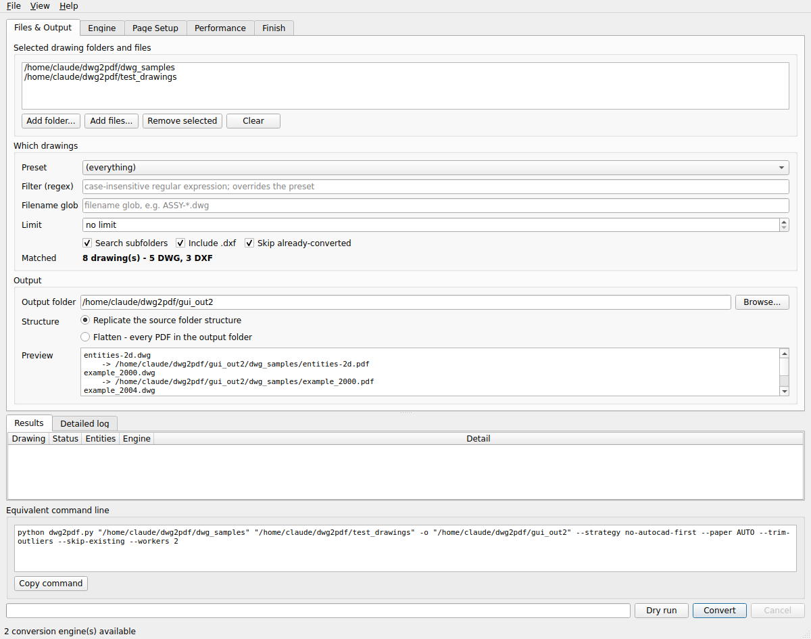
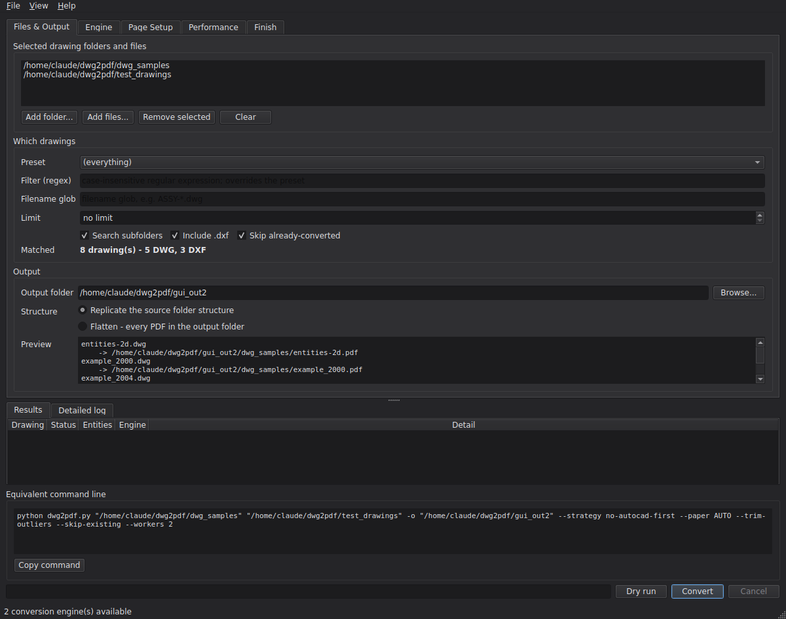
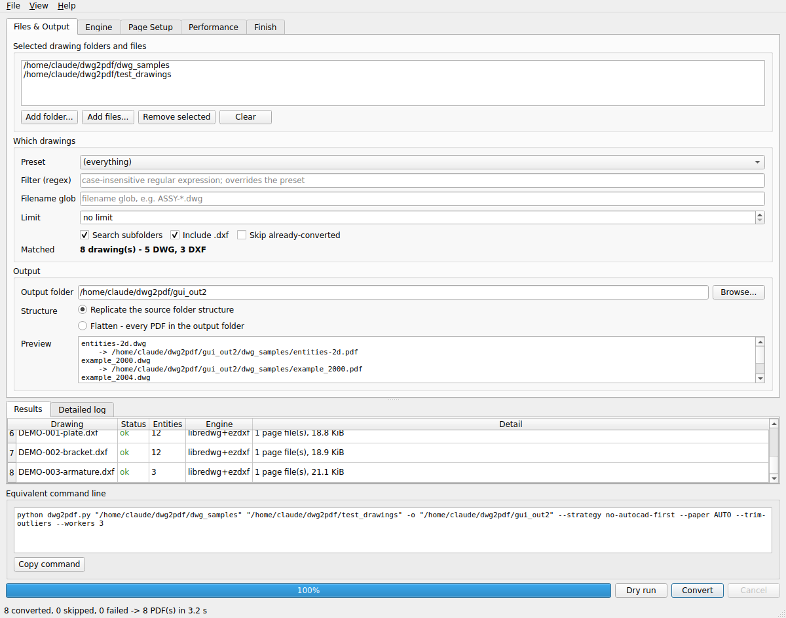
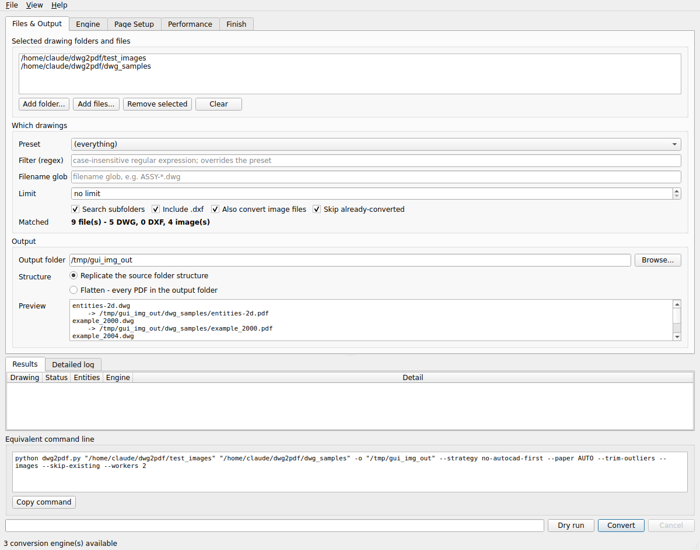

# dwg2pdf — batch 2D AutoCAD drawing (and image) → PDF conversion

**Engine `dwg2pdf.py` rev 0.3.18 · GUI `dwg2pdf_gui.py` rev 0.2.14**
Python 3.12 · QtPy/PySide6 · MIT-licensed tooling around GPL-3 LibreDWG

Converts a tree of 2D AutoCAD drawings (`.dwg`, `.dxf`) into a mirrored tree of
PDFs, with a manifest recording what happened to every sheet. Command line for
the big batch, GUI for everything else.

> **Validated on a real archive.** Five production panel-fabrication sheets
> (a mix of AutoCAD R14 from 1997 and R2018) convert 5/5 to correctly-sized
> ANSI E pages — border zones, revision block, title block, tolerances and
> detail views all intact. Getting there exposed three more defects; see
> §9.10–8.15.
>
> **The headline.** This has been run end-to-end against **real DWG files
> spanning R11 → R2013**, converting all of them, **with no Autodesk software
> installed anywhere** — so it works whether or not AutoCAD is present. On a
> machine that *has* AutoCAD, AutoCAD becomes an
> automatic **per-drawing fallback** for sheets the free engines cannot decode.
> Testing and field runs have found **nineteen** defects so far. **Six**
> produced a *silently wrong* PDF rather than an error — a plausible-looking
> file, a clean log, and the wrong thing on the page. Two more produced a
> perfectly correct PDF that was 120× and 240× larger than it needed to be,
> which is just as invisible. All fixed: nineteen in §9, the two size
> defects in §6.2.

## What changed in this release

| Item | Change |
|---|---|
| **LibreDWG is bundled** | Windows x86-64 binaries ship in `vendor/libredwg-win64/`. Nothing to install: DWG converts without any Autodesk software, out of the box. Cross-compiled here with MinGW-w64 and **verified by running the `.exe` and converting a real R2013 DWG** (67 entities). |
| **DWG TrueView removed** | It crashed in the field (`Unhandled Exception c0000027` = STATUS_UNWIND) and raised a modal *configuration file may be locked* dialog. It is excluded from every automatic chain. §2.2 |
| **AutoCAD-only strategy** | `--strategy autocad-only`, plus AutoCAD-first and no-AutoCAD-first. Refuses clearly if `accoreconsole.exe` isn't found, and never accepts a TrueView console in its place. |
| **`--paper AUTO`** | Reads the sheet size from the drawing's own paperspace page setup; falls back to FIT when there is none. Verified: picked up 420×297 from a D-SIZE layout. |
| **GUI restructured** | Five tabs exposing every engine option, multi-folder input list, replicate-vs-flatten with live preview, parallelism by cores or job count, detachable log window, 7z packaging. |
| **Two-pass parallelism** | A chain ending in the serial-only `acad-com` used to force the *whole run* to one worker (and the GUI ignored the constraint entirely, which would have had several workers fighting over one COM object). Now: pass 1 runs the parallel-safe prefix concurrently, pass 2 retries only the failures serially against the full chain. §2.4 |
| **Drawing units honoured** | A DXF stores bare numbers. A 44 × 34 **inch** ANSI E sheet was becoming a 44 × 34 **millimetre** page. `--units auto` reads `$INSUNITS`, then `$MEASUREMENT`, and these drawings now come out at 1130 × 873 mm. §9.12 |
| **Positional outlier detection** | The old test found entities that were too *big*. On these drawings every entity is small — two strays are simply parked 4800 units away, inflating the extents from 72 × 115 to 4862 × 3654. Now tested by position too, via median-absolute-deviation. §9.11 |
| **Bundled decoder wins over PATH** | conda-forge ships libredwg **0.11.3876 (2020)**; `vendor/` has **0.14**. PATH-first silently preferred the older one — the one that emitted the dangling `*X` block. §9.10 |
| **`acad-com` backend** *(new)* | The **full AutoCAD**, driven over COM with `Application.Visible = False` — real plot styles, page setups, xrefs and SHX fonts, no window. Serial; needs `pywin32`. Attaches to a running AutoCAD without hiding it. §2.3 |
| **Dangling block references repaired** | LibreDWG emitted an `INSERT` referring to block `"*X"` with no definition. It fails at *render* time, not load time, so the `recover` fallback never fired. The missing block is now created empty — non-destructive, and the rest of the sheet renders. §9.9 |
| **`--layouts auto`** *(new default)* | Renders paper space where paper space has drawable content, model space otherwise — **per drawing**. Asking for `paper` on a model-space drawing finds AutoCAD's empty default `Layout1` and fails the sheet; `auto` never does. §5.1 |
| **AutoCAD script paths quoted** | In a `.scr` file **a space is Enter**, so an unquoted output path was chopped at every space and its fragments run as commands — AutoCAD exited 0 having written nothing. Fixed, plus `--accore-script` / `--accore-lang` overrides and full console capture on failure. §9.7 |
| **Start-up log noise absorbed** | fontTools' `'name' table stringOffset` and ezdxf's `ignoring DIMTXSTY override` are explained once instead of repeated per font and per dimension, and all Python logging now goes to the GUI's Detailed log tab. §9.8 |
| **⚠️ accoreconsole had never once worked** *(fixed)* | `-EXPORTPDF` is an `acad.exe` command and **does not exist in the core console**, which runs on `accore.dll`. Every AutoCAD fallback in every run went to the serial `acad-com` instead. Invisible until §9.17 decoded the console and `Unknown command "-EXPORTPDF"` appeared. Now drives `-PLOT`, which is core. §9.18 |
| **⚠️ Every large scan refused as a "decompression bomb"** *(fixed)* | Pillow refuses images over ~89 MP as a security measure. A large-format sheet at archival dpi is routinely 240+ MP, so 37 of the operator's own scans failed with a DOS-attack warning. Limit lifted — and the memory ordering fixed so lifting it is safe. §9.19 |
| **libvips used when available** | Demand-driven streaming instead of materialising every intermediate. On a 244 MP scan: **76 MB peak and 0.65 s**, against 603 MB and 1.39 s for Pillow. Optional; Pillow remains the fallback. §6.4 |
| **Image conversion** *(new)* | `--images`, one "Also convert image files" checkbox in the GUI. JPEG, PNG, TIFF, BMP, GIF, WebP, JPEG 2000, AVIF, ICO, Netpbm, Targa, PCX, EPS and Windows metafiles. Multi-page TIFF becomes a multi-page PDF; transparency flattens onto white; page size comes from the DPI tag. §6 |
| **⚠️ Image PDFs were 120× and 240× too large** *(fixed)* | Encoding every frame as PNG turned a 26 KiB JPEG into a 3.1 MiB page; and `Document.save()` writes streams **uncompressed by default**, turning a 2.3 KiB PNG into a 1409.7 KiB page. Both produce a perfectly valid PDF that is merely enormous. The mixed test set went from **17.6 MiB to 164 KiB**. §6.2 |
| **Per-page bookmarks** | A single document with several pages — a multi-page TIFF, or an AutoCAD export of all layouts — now gets one child bookmark per page. Every converted file, drawing or image, carries a bookmark named after its source file. §5.2 |
| **⚠️ AutoCAD was never quit** *(fixed)* | An "AutoCAD Error Aborting — FATAL ERROR: Unhandled Access Violation" dialog at the end of a run that had **completely succeeded**. There was no `Quit`, no `CoUninitialize`, no `atexit` anywhere: a hidden AutoCAD was started and abandoned, so the interpreter tore down the COM apartment underneath a still-running application. Also left an invisible AutoCAD holding a licence seat after every run. §9.16 |
| **⚠️ accoreconsole diagnostics destroyed** *(fixed)* | The console writes **UTF-16LE**; it was decoded with the locale encoding, so every character arrived followed by a NUL and collapsing whitespace turned them into spaces. That is why a real failure was reported as `Console tail: d`, then `Console: R` — one character, from a stream that was mostly NUL. §9.17 |
| **`--strategy no-autocad`** *(new)* | Never touch AutoCAD at all — no licence seat, no GUI application, no modal dialogs, no PDF viewer. Even `no-autocad-first` keeps AutoCAD in the chain; there was no way to say "not at all". §5.3 |
| **⚠️ `--monochrome` silently ignored by AutoCAD** *(fixed)* | The ezdxf renderer honoured it, so the flag looked as though it worked — and then AutoCAD produced a colour PDF with no warning anywhere. `PlotToFile` takes a `.pc3` but **not** a `.ctb`, and `-EXPORTPDF` has no plot-style argument at all: the style table belongs to the *layout*. Both backends now push `monochrome.ctb` onto the layouts first. §9.13 |
| **⚠️ One AutoCAD crash failed every remaining drawing** *(fixed)* | The COM `Application` is cached so AutoCAD starts once, not per drawing — but nothing checked it was still alive, so after a crash every later sheet called into a dead object. That is "it converted one file and then errored out". Liveness is now probed before each drawing and AutoCAD restarted when it has gone. §9.14 |
| **`--acad-pc3`** *(new)* | AutoCAD opening every finished PDF in a viewer is **a custom property of the `.pc3`**, not a system variable — no `SETVAR` reaches it. Point this at a copy of the plotter config with that box cleared. §9.15 |
| **Worker recycling off by default** | `--recycle-after` was 25. With 4 workers that means all four processes respawn simultaneously at file 100 — indistinguishable from a freeze at the hundredth document — and each respawn re-imports the entry module under *spawn*. Measured: 24 trivial tasks, **1.21 s** off vs **not finished in two minutes** on. Default is now **0 (off)**. §8 |
| **`retry-pending` status** *(new)* | A drawing that pass 1 could not convert was labelled `failed` before `acad-com` had ever been tried on it. It is now amber `retry-pending` until pass 2 actually runs it. §2.1 |
| **Multiprocessing context fixed** | `max_tasks_per_child` silently forces the *spawn* start method, which re-imports the entry module in every worker. Caught by a test that printed its own output four times. Both files now choose the context deliberately. |

---

## Quick start

```bash
mamba env create -f environment-dwg2pdf.yml
mamba activate dwg2pdf
python dwg2pdf_gui.py            # the GUI
python dwg2pdf.py --probe        # or the command line
```

**There is nothing else to install.** LibreDWG ships in `vendor/`, so DWG
converts with no Autodesk software at all; and where AutoCAD 2025 is present
its `accoreconsole` backend is found automatically and used as a per-drawing
fallback — or exclusively, with `--strategy autocad-only`.

---

## 0. The GUI

`dwg2pdf_gui.py` — QtPy targeting PySide6, Python 3.12, Light/Dark under
**View**, and a detachable log under **View → Open log in window** (Ctrl+L).
Five tabs, between them exposing **every** engine option.



*Light and dark are a menu item, not a rebuild: `View → Dark`. Fusion style is
forced first, because the native Windows style ignores palettes and the menu
item would otherwise do nothing at all — see §8 for how that was caught.*

### Tab 1 — Files & Output

- A real **multi-folder input list**: add any mix of folders and individual
  drawings, remove or clear them.
- Filters: `Preset` (named regex shortcuts, edited in `PRESETS` at the top of
  the engine), a regex `Filter`, a filename glob, a `Limit` for trial runs,
  subfolder and `.dxf` toggles, and resume.
- **Output panel** with the destination path and a **Structure** choice:
  *Replicate the source folder structure* or *Flatten into one folder*.
- A live **Preview** showing where the first few PDFs will actually be
  written, so the structure choice is visible rather than described. (Flatten
  is worth thinking about: two `Detail.dwg` in different folders become one
  PDF.)

### Tab 2 — Engine

| Strategy | Behaviour |
|---|---|
| *Without AutoCAD first, fall back to AutoCAD* **(default)** | Free engines first; any sheet they fail goes to AutoCAD. Faster, parallelises, and uses no AutoCAD licence seat except where needed. |
| *AutoCAD first, fall back to the rest* | AutoCAD leads. Choose when fidelity matters more than throughput — it alone honours CTB/STB plot styles, named page setups, SHX fonts and dynamic blocks exactly. |
| *AutoCAD only* | No fallback at all. Use when a differently-rendered PDF would be worse than a failure. |
| *Best available only* | No fallback. |

Also here: a **Force engine** override, an explicit **accoreconsole.exe path**
box for a non-standard AutoCAD install, the per-drawing timeout, an
**AutoCAD script template** override (`{output}` is substituted) for a release
whose `-EXPORTPDF` prompts differ, an **AutoCAD language** box (left blank by
default on purpose), and a live probe of every engine with its status.

**The fallback is per drawing, not per run.** In a real archive it is
individual sheets that defeat a decoder, not the whole set. A drawing that
needed the fallback still counts as converted, and the manifest records which
engine produced it and what the earlier one said — so a pattern ("every R11
sheet fell through to AutoCAD") is visible afterwards instead of lost.

### Tab 3 — Page Setup

**Layouts** — *Automatic* (default), Model space only, Paper space layouts,
Both, or a named layout. Automatic decides **per drawing**: paper space where
paper space has drawable content, model space otherwise. That is the mode for
an uncatalogued archive — asking for *Paper space layouts* on a model-space
drawing finds AutoCAD's empty default `Layout1` and fails the sheet.

**Paper** — *AUTO* (default) reads the sheet size from the drawing's own paper
space page setup and falls back to FIT when there is none; or FIT, or a named
size. Plus orientation, max-page cap, margin, scale, monochrome, line-weight
multiplier, background, and stray-entity trimming with its factor.

### Tab 4 — Performance

| Mode | When |
|---|---|
| **Automatic (by CPU cores)** *(default, 75%)* | Normal use. Each drawing is independent, so this scales almost linearly until the disk saturates. |
| **Fixed job count** | Something else is competing for the machine, or the AutoCAD backend is in use and licence seats are limited — every worker checks one out. |
| **Serial** | Debugging a single sheet. |

The resolved worker count is shown live, so there is no guessing. Plus worker
recycling and RSS logging.

*Cores is the better default.* The work splits between a decoder subprocess
(I/O-bound, releases the GIL) and ezdxf's C extensions (CPU-bound), so ~75% of
logical cores keeps every core fed without thrashing. There is deliberately no
GPU path — DXF→PDF is a vector-to-vector transform with no dense arithmetic
kernel. Scale by cores, not cards.

### Tab 5 — Finish

Manifest, merge-into-one-PDF, and **packaging the whole output into a single
archive** — 7z preferred, ZIP fallback if no 7-Zip binary is found (it says so
and carries on rather than failing at the end of a long run). The default
archive name carries both revisions and a timestamp:

```
dwg2pdf_out_v0.3.4_gui0.2.3_20260903-161500.7z
```

so two runs never collide and any archive traces back to the code that made
it.

### Throughout

The **Equivalent command line** box always shows the exact `dwg2pdf.py`
command matching the current settings — copy it into a terminal for scheduled
or scripted runs. Conversion runs on a `QThread` with a real process pool, so
the window stays responsive; **Cancel** is cooperative, stopping after
in-flight drawings rather than leaving truncated PDFs.



The results table is per drawing: `ok`, `skipped`, `failed`, and — during a
two-pass run — amber `retry-pending` for a drawing that pass 1 could not
convert and that pass 2 has not reached yet (§2.1).



---

## 1. Why `dwg_to_pdf.py` failed — and what changes now there is AutoCAD

> **Update.** The target machine for the real run has **AutoCAD 2025**
> installed. That is not the machine scanned below, and it changes the
> picture: with AutoCAD present the `accoreconsole` backend is available and
> becomes the automatic per-drawing fallback, and **nothing else has to be
> installed**. The analysis below still explains why the earlier tool failed
> where it was tried, and still applies to any machine without AutoCAD.

### 1.1 A machine with no Autodesk software

An AutoCAD-automation converter is a reasonable design.   Both of its engines — `--engine com` (AutoCAD over COM) and
`--engine core` (`accoreconsole.exe`) — require a **full AutoCAD installation**.

Scanning one such machine:

| Checked | Result |
|---|---|
| `C:\Program Files` | **no `Autodesk` folder** (it would sort between `Application Verifier` and `CCleaner`; it is absent) |
| `C:\Program Files (x86)` | **no `Autodesk` folder** |
| AutoCAD | not installed |
| DWG TrueView | not installed |
| ODA File Converter / QCAD / LibreDWG | not installed |

So on this machine `dwg_to_pdf.py` cannot succeed regardless of what is fixed
in it — there is nothing for either engine to drive. Two things follow:

1. **Field failures can come from a different computer than you think** —
   one with only *DWG TrueView* installed, whose console is the one that
   gets found.
2. **If that machine has TrueView but not AutoCAD, both engines are dead ends
   there too.** TrueView has no plotting engine — `-EXPORTPDF` and `-PLOT` do
   not exist in it — which rev 0.0.3 correctly diagnosed for `--engine core`.
   The same absence limits the COM path.

`dwg2pdf.py` takes the other road: three of its six backends need **no Autodesk
software at all** — and where AutoCAD *is* present, it is used as well.

### 1.2 The TrueView trap is guarded here too

Rev 0.0.3 of the old tool diagnosed this correctly, and the same guard is built
into this one. DWG TrueView installs a file called `accoreconsole.exe` directly
beside AutoCAD's, and `"DWG TrueView 2025 - English"` sorts *above*
`"AutoCAD 2025"`, so a newest-first search picks the wrong one every time.
TrueView has no plotting engine, so this tool **rejects** a TrueView console
outright rather than keeping it as a last-resort fallback — it is not a degraded
option, it is a guaranteed failure — and `--probe` says so explicitly when it
finds one.

---

## 2. The seven backends

| Rank | Backend | Reads DWG | Licence | Needs AutoCAD? | Notes |
|---|---|---|---|---|---|
| 1 | `accoreconsole` | ✅ | Requires AutoCAD | **Yes** | Highest fidelity: real CTB/STB plot styles, page setups, xrefs, SHX fonts. |
| 2 | `qcad` | ✅ | QCAD **Professional** (paid) | No | Purpose-built for this: paper, scale, margin, mono, auto-fit as flags [4]. |
| 3 | ~~`trueview`~~ | — | — | — | **DISABLED — crashes when script-driven.** See §2.2. |
| 4 | `oda+ezdxf` | ✅ | ⚠️ **Non-commercial only** for ODA non-members [1] | No | Most complete non-Autodesk DWG decoder. |
| 5 | `libredwg+ezdxf` | ✅ | GPL-3, **no use restriction** | No | **BUNDLED — Windows binaries ship in `vendor/`.** Proven working; see §3. |
| 6 | `ezdxf` | ❌ DXF only | MIT + AGPL (PyMuPDF) | No | `pip install ezdxf pymupdf`, nothing else. |

`--probe` reports which are present and picks the best automatically.

### 2.3 Two ways to use AutoCAD

| | `accoreconsole` | `acad-com` |
|---|---|---|
| What it is | AutoCAD's headless core console | The full AutoCAD application over COM |
| Window | none | none (`Application.Visible = False`) |
| Parallel | ✅ | ❌ serial — one COM Application per session |
| Extra install | none | `pip install pywin32` |
| Fidelity | full | full |

**Why not `acad.exe /b script.scr`?** It accepts `/b` and runs the script, but
`acad.exe` has no supported headless mode — the window appears, and a thousand
drawings means a thousand window activations stealing focus. Being headless is
exactly what `accoreconsole` exists for; `Visible = False` over COM is how you
get the same result from the full application.

**It will not hijack a session you are using.** If AutoCAD is already running,
`acad-com` attaches to that instance and *leaves its visibility alone* — hiding
a window someone is working in would be indefensible. Only an instance the
backend started itself is hidden. Close AutoCAD first if you want the invisible
path.

> **Not executed by its author.** There is no AutoCAD, Windows or COM in the
> environment this was built in. The COM path is reasoned from Autodesk's
> ActiveX reference and from the field failures recorded in
> the earlier notes — the quiescence waits and busy-aware retry that
> solved a real *Invalid execution context* failure are reused rather than
> reinvented. **Convert five sheets with `--limit 5` before trusting it with
> the archive.**

### 2.4 How the fallback actually moves between engines

It is automatic and multi-level — nothing to configure. On a machine with
AutoCAD 2025 and the bundled decoder, the default strategy builds:

```
libredwg+ezdxf  →  accoreconsole  →  acad-com
```

`_convert_task` walks that chain **per drawing** and stops at the first
backend that writes a non-empty PDF. So a sheet the free decoder cannot read
goes to AutoCAD's headless console; if that also fails, it goes to the full
AutoCAD over COM. The manifest records which one won and what the earlier ones
said.

The four strategies produce:

| Strategy | Chain |
|---|---|
| Without AutoCAD first *(default)* | `libredwg+ezdxf → accoreconsole → acad-com` |
| AutoCAD first | `accoreconsole → acad-com → libredwg+ezdxf` |
| AutoCAD only | `accoreconsole → acad-com` |
| Best available only | `accoreconsole` |

**The parallelism problem this creates, and how it is handled.** `acad-com`
drives a single COM `Application` and cannot run concurrently. The obvious
response — force the whole run to one worker — is a bad trade: it would
serialise three thousand drawings to accommodate a fallback that maybe thirty
of them reach.

So the run is done in two passes:

1. **Pass 1, parallel:** every drawing through the parallel-safe prefix
   (`libredwg+ezdxf → accoreconsole`), at full worker count.
2. **Pass 2, serial:** only the drawings that failed, retried against the
   *full* chain so they reach `acad-com`.

Same outcome, same fallback behaviour, without paying for it on every sheet.
A chain whose *first* backend is serial-only (`--backend acad-com`) runs
entirely serially, which is correct — there is nothing else to try. The
Performance tab shows which case applies before you start.

Verified with an injected serial-only backend: 6 drawings, 3 failing in
pass 1, all 3 recovered in pass 2 — 6/6 converted, 3 via the serial backend.

**Reading the status column while a two-pass run is in flight.** A drawing that
pass 1 could not convert is *not* a failure yet — the full chain has not been
tried on it. Marking it `failed` was actively misleading: it looked as though
AutoCAD had been tried and lost, when `acad-com` had not run at all. So a
pass-1 miss is now shown as **`retry-pending`** (amber, not red), with
"queued for the serial retry with the full engine chain" in the log. It becomes
`ok` or `failed` only after pass 2 has actually run it. Note that pass 2 starts
only once pass 1 has finished *every* drawing, so on a large run the amber rows
can sit there for a long time before they resolve — that is the design, not a
stall.

### 2.2 Why DWG TrueView is disabled

It was tried on the target machine, and it did not fail gracefully — it failed
twice, in two different ways:

1. **`Unhandled Exception c0000027 (c0000027h) at address 7513187ah`** —
   `STATUS_UNWIND`. TrueView fell over *inside its own exception handling*.
   No PDF, no useful diagnostic.
2. **`Configuration file may be locked by another process or have been set
   Read Only (.cfg, .bak). File: ...\dwgviewr2025.cfg`** — a modal dialog
   demanding Retry or Cancel. A modal dialog in an unattended batch is a
   hang, and it is exactly what script-driving a GUI application invites.

Both are consistent with what TrueView is: a *viewer*. Autodesk does not
support driving it as a plot engine, so it has no obligation to behave when
scripted — and it does not. `unreliable = True` removes it from every
automatic chain. It can still be named explicitly (`--backend trueview`),
which logs a warning first, kept only so the option is documented rather than
mysteriously absent.

**Use AutoCAD, or the bundled LibreDWG.** Both work.

### 2.1 The ODA licence trap

ODA's free tools may be used by non-members **"for non-commercial applications
only"** [1]. If the archive is being converted for paid or contract work, backend 4
is not licensed to you unless your organisation is an ODA member.

The module enforces this structurally: `oda+ezdxf` is flagged
`needs_licence_optin` and is **never auto-selected** while any alternative
exists. Naming it explicitly (`--backend oda+ezdxf`) works and logs a warning.
Backends 1, 2, 3 and 5 carry no such restriction.

---

## 3. What was actually proven, on real DWGs

LibreDWG **0.14.8593** was built from source in the Linux session container
(cmake; the `jsmn` submodule must be initialised or the build dies at
`in_json.c`). Five real DWG files from LibreDWG's own corpus, deliberately
spanning the format's whole history, were converted end to end:

| Source file | DWG era | Entities rendered | Result |
|---|---|---:|---|
| `entities-2d.dwg` | **R11** | 13 | ✅ |
| `v.dwg` | **R14** | 17 | ✅ |
| `example_2000.dwg` | **R2000** | 67 | ✅ |
| `example_2004.dwg` | **R2004** | 67 | ✅ |
| `example_2013.dwg` | **R2013** | 67 | ✅ |

**5 of 5**, on a machine with no Autodesk software. R11 and R14 matter here:
the archive is a 1990s archive, so its oldest sheets are exactly that vintage.

---

## 4. Install

```bash
mamba create -n dwg2pdf python=3.12
mamba activate dwg2pdf
pip install ezdxf pymupdf
pip install psutil          # optional: enables --report-memory
```

Then **one** DWG reader. On Windows, in order of preference:

| Option | Command / source | Commercial use | Note |
|---|---|---|---|
| **QCAD Professional** | qcad.org | ✅ | Best batch ergonomics; paid |
| **DWG TrueView** | autodesk.com [9] | ✅ | Free; GUI; serialised |
| **LibreDWG** | `mamba install -c conda-forge libredwg` | ✅ GPL-3 | ⚠️ conda-forge is **0.11.3876, uploaded 2020-11-17** [7] — six years behind the 0.14 proven above |
| **ODA File Converter** | opendesign.com [8] | ❌ non-members | Most complete decoder |

**Or skip Windows entirely** — see §9.

---

## 5. Use

```bash
python dwg2pdf.py --probe                            # what can this machine do?
python dwg2pdf.py archive/ -o pdf/ --dry-run         # plan only, touches nothing
python dwg2pdf.py archive/ -o pdf/ --workers 6       # convert, mirrored tree
python dwg2pdf.py archive/ -o pdf/ --skip-existing   # resume after interruption
python dwg2pdf.py archive/ -o pdf/ --merge set.pdf   # one bookmarked PDF as well

# a named subset rather than the whole archive
python dwg2pdf.py archive/ -o pdf/ --preset example-prefix --trim-outliers

# AutoCAD only, for a sheet that came out wrong
python dwg2pdf.py archive/one.dwg -o pdf/ --backend accoreconsole
```

### 5.0 Presets

Carried over from the earlier AutoCAD converter so the two speak the same
language. `--filter` takes any case-insensitive regex; `--preset` is a name for
a common one.

| Preset | Regex | Contents |
|---|---|---|
| `example-prefix` | `^12\d{4}` | drawings whose number starts `12` + four digits |
| `example-group` | `(_01_\|_02_\|_03_)` | an alternation of sheet numbers |
| `all` | `.` | everything |

Edit `PRESETS` at the top of `dwg2pdf.py` to name the subsets you actually
use; they appear in the CLI and the GUI dropdown automatically.

`--limit N` stops after N drawings, for a trial run.

### 5.1 The three options that decide whether the output is usable

**`--layouts`** — the most common cause of a batch that "succeeds" with wrong
pages. Leave it on `auto` unless you know the whole set is one or the other.

- `auto` *(default)* — decided per drawing: paper space where paper space has
  drawable content, model space otherwise. §5.1 above.
- `model` — modelspace only. Right for older 2D drawings whose title block is
  drawn as geometry in modelspace.
- `paper` — every paperspace layout, one PDF each. Right for drawings with real
  title-block layouts.
- `all` — both; use on a mixed archive, at the cost of redundant pages.
- *`<name>`* — one named layout.

A manifest row with `status=ok` and `entity_count=0` means an empty layout was
rendered. That is the signature of the wrong `--layouts` value.

**`--trim-outliers`** — turn this on for an old archive. See §9.5.

**`--max-page-mm`** *(default 1189)* — caps an auto-sized page. See §9.4.

Also: monochrome is the default (`--colour` to keep colours);
`--lineweight-scale 2.0` if lines look thin; `--paper A3 --landscape` for a
fixed sheet; `--scale 0.02` for a true 1:50 plot instead of fit-to-page.

### 5.3 `--strategy no-autocad`

AutoCAD is the only backend that starts a GUI application, checks out a
licence seat, can raise a modal dialog, and may hand each finished PDF to a
viewer. On an archive where the free decoder already converts almost
everything, paying all of that for the last one per cent is often the wrong
trade — a real 52-drawing run converted **51 with the bundled decoder** and
needed AutoCAD for exactly one.

`--strategy no-autocad` removes it from the chain entirely. Sheets the free
engines cannot decode are reported as failures, which you can re-run
separately with `--strategy autocad-only` when it suits you, rather than
having AutoCAD start and stop in the middle of an unattended batch.

### 5.2 `--merge` and its bookmark outline

`--merge FILE` concatenates every produced PDF into one document, in discovery
order. On an archive of any size that document is unusable without navigation
— five hundred D-size sheets and no way to reach one but scrolling — so it is
written **with a bookmark outline built from the source tree**.

`--merge-bookmarks` chooses the shape:

| Mode | Outline |
|---|---|
| `tree` *(default)* | Each drawing nested under its source folders, so the merged document navigates the same way the archive does. |
| `flat` | One entry per drawing, titled with its whole relative path. Better on a shallow tree, or when you would rather search bookmark titles than expand folders. |
| `none` | No outline. |

From a real run over a nested tree:

```
Assembly                        -> p.1
   Details                      -> p.1
      example_2013.dwg          -> p.1
   Panels                       -> p.2
      example_2000.dwg          -> p.2
      example_2004.dwg          -> p.3
Subassembly                     -> p.4
   v.dwg                        -> p.4
entities-2d.dwg                 -> p.5
```

and the same set with `--merge-bookmarks flat`:

```
Assembly/Details/example_2013.dwg   -> p.1
Assembly/Panels/example_2000.dwg    -> p.2
Assembly/Panels/example_2004.dwg    -> p.3
Subassembly/v.dwg                   -> p.4
entities-2d.dwg                     -> p.5
```

**Layouts get their own children.** A drawing converted with `--layouts all`
produces one PDF per layout, named `<stem>__<layout>.pdf`. Rather than listing
three indistinguishable copies of the drawing name, the outline nests them and
recovers the layout name from the suffix:

```
sub                             -> p.2
   DEMO-002-bracket.dxf         -> p.2
   DEMO-003-armature.dxf        -> p.3
      Model                     -> p.3
      D-SIZE                    -> p.4
```

A drawing with only one PDF gets no child — a lone child that repeats its
parent is noise, not navigation.

Two things worth knowing, because both are easy to get wrong:

- **Page numbers come from where each PDF landed**, not from its position in
  the manifest. A sheet whose PDF has three pages advances the counter by
  three. A bookmark pointing at the wrong page is worse than no bookmark.
- **The outline follows the *source* tree, not the output tree.** `--flat`
  writes every PDF into one folder, and the bookmarks still show the folder
  structure the drawings came from — which is the point of having them.

Failure is contained: an unreadable PDF costs its own bookmark and is logged,
not the whole merge of a thousand sheets; and if PyMuPDF rejects the outline
the merged document is still written, without it.

---

## 6. Images

`--images` (or the single **Also convert image files** checkbox in the GUI)
also converts image files found in the selected folders. A drawing archive is
rarely only drawings: scanned sheets, exported details and vendor cut-sheets
sit in the same folders, and a PDF set that silently omits them is incomplete
in a way nobody notices until they go looking for one.

| Group | Extensions |
|---|---|
| JPEG | `.jpg` `.jpeg` `.jpe` `.jfif` |
| PNG | `.png` |
| TIFF | `.tif` `.tiff` *(multi-page)* |
| Windows bitmap | `.bmp` `.dib` |
| GIF | `.gif` *(multi-frame)* |
| Modern web | `.webp` `.avif` |
| JPEG 2000 | `.jp2` `.j2k` `.jpf` `.jpx` |
| Netpbm | `.ppm` `.pgm` `.pbm` `.pnm` |
| Other raster | `.ico` `.tga` `.pcx` |
| PostScript | `.eps` |
| Windows metafiles | `.emf` `.wmf` — **Windows only**, see below |

It is **opt-in**, because a drawing folder usually also holds thumbnails, logos
and scanned correspondence that nobody wants in a drawing set.

`ImageBackend` never joins the fallback chain: no CAD engine can open a JPEG
and Pillow cannot open a DWG, so there is nothing to fall back to in either
direction. Files are routed by suffix instead.

### 6.1 Four things that are easy to get quietly wrong

- **Multi-page TIFF.** A sheet-fed scanner produces one, and keeping only
  frame one would lose most of a scanned set. Every frame becomes a PDF page,
  and each gets its own bookmark under the file's name.
- **Transparency is flattened onto white.** A PDF page has no alpha, and an
  unflattened RGBA frame turns transparent pixels *black* — on a scanned
  drawing, a black sheet.
- **Physical size comes from the DPI tag**, capped by `--max-page-mm` exactly
  as a drawing's FIT page is. A 12000 × 9000 scan at 72 dpi is otherwise a
  4.2 m page. An image with no DPI tag falls back to 96 dpi and *says so in
  the log* rather than silently guessing.
- **`--monochrome` gives greyscale, not 1-bit.** This backend sees photographs
  and greyscale scans as well as line art, and a threshold that flatters the
  third ruins the first two.

**`.emf` and `.wmf` need Windows.** Pillow renders metafiles through the
Windows GDI; on Linux or macOS it can read the header but not the picture.
The failure says exactly that rather than "cannot identify image file", so
nobody spends an afternoon on a file that is perfectly fine.

### 6.2 ⚠️ Two measured size defects *(fixed)*

Both produced a perfectly valid PDF that was merely enormous — the kind of
thing nobody notices until the archive will not fit in an email.

| Defect | Measured |
|---|---|
| Every frame encoded as **PNG** | a **26 KiB** JPEG → a **3.1 MiB** page (**120×**) |
| `Document.save()` writes streams **uncompressed by default** | a **2.3 KiB** PNG → a **1409.7 KiB** page (**240×**) |

PNG stores photographic data losslessly, and a scan *is* photographic data.
So now: an untouched JPEG is embedded **byte for byte** (PDF stores JPEG
natively, so there is no re-encode and no generation loss), large photographic
frames are encoded as JPEG at quality 92, and PNG is kept for line art,
screenshots and flat colour — where it is both smaller *and* exact.
`--image-lossless` forces PNG throughout for anyone who would rather have a
large exact file than a small nearly-exact one.

The second is a one-word fix and a factor of 240:

```python
doc.save(target, deflate=True, garbage=3)   # not doc.save(target)
```

On the mixed test set — one DWG and five images — the combined PDF went from
**17.6 MiB to 164 KiB**.

### 6.3 Large scans, and why libvips matters here

An E-size sheet scanned at archival resolution is **240+ megapixels**. That is
not an edge case in a drawing archive, it is the normal case, and it breaks
naive image handling in two separate ways.

**Pillow refuses them outright.** Its `MAX_IMAGE_PIXELS` guard rejects anything
over ~89 MP as a possible decompression bomb — correct for a web service
decoding untrusted uploads, wrong for the operator's own scans on their own
disk. On a real archive this failed 37 files with a security warning. The guard
is lifted (§9.19).

**And lifting it alone would exhaust memory.** The numbers for one 244 MP
bilevel scan:

| Stage | Cost |
|---|---|
| On disk (Group 4) | **0.1 MB** |
| Loaded by Pillow, mode `1` | **250 MB** — Pillow stores 1-bit as a *byte* per pixel |
| Converted to RGB | **732 MB** |
| × 4 workers | **2.9 GB** |

So the order of operations is the fix: **downsample first, in the native mode,
and leave greyscale as greyscale.** PDF has a DeviceGray colour space, so
promoting `L` to `RGB` buys nothing and costs three bytes per pixel instead of
one. Peak fell from **1564 MB to 603 MB**.

**libvips does far better still**, because it is demand-driven: it streams the
image through a pipeline rather than materialising every intermediate.

| Path | Peak RSS | Time | 4 workers |
|---|---:|---:|---:|
| Pillow | 603 MB | 1.39 s | ~2.4 GB |
| **pyvips** | **76 MB** | **0.65 s** | **~300 MB** |

```bash
pip install pyvips pyvips-binary     # the second carries the native library
```

It is entirely optional — everything works through Pillow without it, and
`.emf`/`.wmf` always use Pillow because they need the Windows GDI. `--probe`
says which path is active.

`--image-max-dpi` *(default 200)* caps the resolution kept on the page. Squared
and applied to a large sheet, this dominates both memory and file size: a
44 × 34 inch drawing is 60 MP at 200 dpi and **546 MP at 600**. Archival scans
are often 600 dpi and there is nothing to gain by carrying that into a PDF
nobody plots at 1:1.

### 6.4 Encoder choice: line art is not photographic

The first version encoded any frame over 0.5 MP as JPEG, on the reasoning that
large images are photographs. **A scanned drawing is not a photograph** — it is
black lines on white, and JPEG is wrong for it in both directions at once: it
puts ringing artefacts around every line *and* comes out larger, because hard
edges are precisely the high-frequency content DCT compacts worst.

Band count is the signal, and it is free to test:

| Content | Bands | Encoder |
|---|---|---|
| Scanned line art, greyscale scan | 1 | **PNG** — lossless, smaller, no ringing |
| Photograph, colour rendering | 3+ | **JPEG** q92, where it wins by an order of magnitude |
| Untouched source JPEG | — | **embedded byte-for-byte**, no re-encode at all |

`--image-lossless` forces PNG throughout.

### 6.5 What it looks like



```
detail.jpg                  -> p.1
drawing.dwg                 -> p.2
logo.png                    -> p.3
scans                       -> p.4
   note.bmp                 -> p.4
   sheets.tif               -> p.5
      page 1                -> p.5
      page 2                -> p.6
      page 3                -> p.7
screenshot.png              -> p.8
```

---

## 7. The manifest

Every run writes `manifest.csv` and `manifest.json` to the output root. On an
archive of this size that is the point of the exercise — "the batch finished" is
not a statement anyone can check.

| Column | Meaning |
|---|---|
| `source` | input drawing |
| `outputs` | `;`-separated PDFs produced |
| `backend` | which route ran |
| `status` | `ok` / `skipped` / `failed` / `dry-run` |
| `seconds` | wall-clock for that sheet |
| `entity_count` | entities rendered — **`0` on an `ok` row is a warning sign** |
| `message` | file sizes, or the error text |

The JSON adds tool revision, Python version, platform, backend and the full
`PageSpec`, so a set of PDFs traces back to the settings that made it.

---

## 8. Performance

Embarrassingly parallel — every sheet is independent — so a `ProcessPoolExecutor`
scales close to linearly until disk or licence server becomes the limit.
Processes not threads: the work is in a subprocess or in ezdxf's C extensions,
and a worker crash cannot take the run down.

**No GPU path, deliberately.** DXF→PDF is vector-to-vector: parse an entity
graph, emit path operators. Branch-heavy pointer chasing with no dense
arithmetic kernel — a GPU has nothing to do. Scale by cores, not cards.

**Memory.** ezdxf holds a whole drawing as a Python object graph. Bounded by:
per-file worker processes; `--recycle-after N` *(default 0 = off)* setting
`max_tasks_per_child`; an explicit `del doc; gc.collect()`; and `--merge`
streaming page-by-page. `--report-memory` logs RSS every ten files.

> **Why recycling defaults to off.** `max_tasks_per_child` is not free, and
> on Windows it is expensive: setting it silently forces the *spawn* start
> method, so every recycled worker re-imports the entry module — Qt
> included — before it can take another file. Measured here: 24 trivial
> tasks finish in **1.21 s** with recycling off and had **not finished in
> two minutes** with `--recycle-after 1`. Worse, the recycles are
> synchronised: with 4 workers and `--recycle-after 25` all four respawn at
> file 100 at the same moment, which looks exactly like a freeze at the
> hundredth document. Turn it on only if `--report-memory` shows RSS
> actually climbing across files.

---

## 9. Nineteen defects found by testing — six of them silent

This is the section worth reading. Every one of these produced a *plausible
looking* result, and six produced a wrong PDF with **no error anywhere**.

### 9.1 Empty layouts failed the whole sheet *(fixed)*

A paperspace containing only a `VIEWPORT` raised `ValueError: empty bounding
box` and failed the entire drawing — even when modelspace had already converted
and the PDF was on disk. Nearly every DWG carries AutoCAD's default
`Layout1`/`Layout2` whether or not anyone drew on them, so on a real archive
this would have failed a large fraction of sheets that were perfectly fine.

Now: empty and unrenderable layouts are skipped with a log line naming them; a
sheet fails only when *nothing* renderable was found.

### 9.2 `--layouts all` reported success as failure *(fixed)*

Same root cause. The modelspace PDF was written, then a later empty layout
raised, and the file was recorded `failed` with its good PDF orphaned on disk.
Partial success is now success, with skipped layouts named.

### 9.3 ⚠️ `--as=r2018` silently discarded every entity *(fixed)*

The worst of the five. Rev 0.0.1 passed `--as=r2018` to `dwg2dxf`, reasoning
that the newest target preserves the most entity types. **It does the
opposite.** When the requested version does not match the source's native era,
LibreDWG writes a structurally valid, correctly sized DXF whose **ENTITIES
section is empty** — and exits 0.

Measured on LibreDWG 0.14.8593, modelspace entity count:

| source | *(no `--as`)* | `r2000` | `r2013` | `r2018` |
|---|---:|---:|---:|---:|
| R11 `entities-2d` | **13** | 0 | 0 | 0 |
| R14 `v.dwg` | **17** | 17 | 0 | 0 |
| R2000 `example` | **67** | 67 | 0 | 0 |
| R2004 `example` | **67** | 0 | 67 | 67 |
| R2013 `example` | **67** | 0 | 67 | 67 |

Omitting `--as` is the only column correct for every input. A ~1 MB DXF was
being produced whose ENTITIES section was **36 characters long**. The fix is to
request no version at all; ezdxf reads whatever LibreDWG emits.

Had this shipped, the archive's older sheets would have become blank PDFs with
a clean success in the log.

### 9.4 ⚠️ Auto-sized pages came out kilometres across *(fixed)*

`--paper FIT` sizes the page to the drawing extents **in drawing units**, and
CAD drawings are modelled at full scale. Measured on a real DWG:
a page **3,411,867 × 2,727,540 mm — 3.4 km of paper**. The PDF was written
without complaint; the *renderer* then refused it (`Overly large image`), and a
viewer shows blank.

Now `--max-page-mm` *(default 1189 mm, the long edge of A0)* bounds an
auto-sized page and lets the content scale down into it.

### 9.5 ⚠️ One stray entity collapsed the drawing to a speck *(fixed, opt-in)*

With the page capped, the same file still rendered as a near-blank sheet. The
cause, measured:

| | span (drawing units) |
|---|---:|
| largest `INSERT` | **3,411,857** |
| next-largest entity | 14,300 |
| median entity | 838 |

One block reference — almost certainly carrying an absurd scale factor — is 238×
the next entity and 4000× the median. Fitting to extents fits to *it*, and the
real drawing is scaled down by three orders of magnitude into a dot. Nothing
errors: the tool was asked to fit the extents and it did.

`--trim-outliers` computes per-entity extents and fits the page to the robust
extents, excluding entities whose span exceeds `--outlier-factor` × the
95th-percentile span *(default 20)*. **Nothing is deleted** — the outlier is
still drawn via ezdxf's `render_box`, it simply no longer defines the page — and
every exclusion is logged and recorded.

Before and after on the same file — a blank sheet with a speck, versus the
full drawing: ellipses, arcs, hatches, splines, solids and all text.

| without `--trim-outliers` | with `--trim-outliers` |
|---|---|
|  |  |

**Recommendation: run the archive with `--trim-outliers`.** A 1990s archive is
where this pathology lives.

### 9.6 Also repaired: zero extrusion vectors

An `INSERT` with extrusion `(0,0,0)` made ezdxf raise `ZeroDivisionError` deep
in `Vec3.normalize()` — observed on the R11 file, exactly the vintage the archive
contains. The DXF default is `(0,0,1)`, so degenerate extrusions are now
repaired in memory (never in the source file) before rendering, and the count is
logged.

---

### 9.7 ⚠️ AutoCAD wrote no PDF: a space in a script is Enter *(fixed)*

From a real the archive run:

```
accoreconsole: RuntimeError: accoreconsole wrote no PDF (rc=0). Console tail: d
```

Exit code 0, no PDF, and a one-character diagnostic. The cause is not AutoCAD:

**In an AutoCAD script file a space is equivalent to pressing Enter.**
Autodesk's guidance is explicit — a name containing spaces must be given in
double quotes [11]. The output path was

```
C:\Drawings\Drawing Set\Assembly Details\PDF\
```

— three separate spaces. AutoCAD took `C:\Drawings\Drawing` as the filename
and then fed `Set`, `Assembly`, `Details\PDF\`… to the command line as
commands. The `d` in the console tail was a fragment of one of them.

Fixed by quoting the path. Also added: `--accore-script` to replace the
generated `.scr` wholesale when a release's `-EXPORTPDF` prompt sequence
differs (`{output}` is substituted), `--accore-lang` (omitted by default —
an uninstalled language pack fails with *Unable to Process Configuration
File*, which reads like a plot problem and is not one), and **the full
console is now captured on failure** rather than a 400-character tail that
reduced this to `d`.

### 9.8 Start-up log noise, explained rather than shown

Two third-party messages appear on a cold start and look like failures:

| Message | From | Why it is harmless |
|---|---|---|
| `'name' table stringOffset incorrect. Expected: 222; Actual: 224` | fontTools, at **ERROR**, while ezdxf builds its font cache | fontTools checks that the OpenType `name` table's `stringOffset` equals `6 + count×12`. The specification defines the field only as *"Offset to start of string storage (from start of table)"* [10] and does not require that packed layout — and fontTools' next statement is `stringData = data[stringOffset:]`, i.e. it uses the real offset and reads the font correctly. Cosmetic. |
| `Required text style #0 does not exist, ignoring DIMTXSTY override.` (×9) | ezdxf, at **WARNING**, once per dimension | The drawing overrides a dimension's text style by handle **#0** — the DXF null handle, meaning *no object*. ezdxf ignores the override and keeps the DIMSTYLE's own text style, which is correct. It comes from the DWG decoder writing an explicit null handle instead of omitting the field. |

Both are now absorbed by `_ThirdPartyNoiseFilter`, which explains each kind
**once** and counts the rest. Ten alarming lines become two informative ones.
Anything not on the list — including `skipping malformed name record`, which
really does mean a broken font, and every warning about the drawing itself —
passes through untouched.

One subtlety worth recording, because the first attempt silently did nothing:
**logger filters are not inherited by child loggers.** A filter on `fontTools`
has no effect on records logged by `fontTools.ttLib.tables._n_a_m_e`;
`Logger.handle` consults only its own filters, and propagation to an
ancestor's *handlers* does not re-run the ancestor's *filters*. The filter is
therefore attached to the exact emitting loggers, and to the GUI's handler as
a backstop.

All Python logging is now routed into the GUI's **Detailed log** tab, so the
engine's per-drawing lines, ezdxf and fontTools all land somewhere visible
instead of on a console nobody launched the GUI from.

---

### 9.9 ⚠️ A dangling block reference kills the sheet at draw time *(fixed)*

From the the archive run:

```
libredwg+ezdxf: DXFStructureError: Required block definition for "*X" does not exist.
```

An `INSERT` names block `"*X"` — a truncated anonymous-block name — that has
no `BLOCK` definition in the file. The DWG decoder wrote the reference without
the definition.

What made this one slippery: **the file loads fine.** The exception comes from
`ezdxf.explode.virtual_block_reference_entities` when the renderer tries to
expand the reference, so it is a *render*-time failure. The
`recover.readfile()` fallback, which only triggers on a load-time
`DXFStructureError`, never got a chance to run.

The repair creates the missing block as an **empty** block. That is the least
destructive option: the `INSERT` resolves, expands to nothing, and every other
entity on the sheet renders. Deleting the `INSERT` would also work but changes
the entity count and loses the placeholder — and there was no geometry to draw
either way, because the definition genuinely is not in the file. Reproduced,
fixed and re-verified end to end.

---

### 9.10 The conda-forge decoder is six years old *(fixed)*

`conda install -c conda-forge libredwg` gives **0.11.3876, uploaded
2020-11-17**. The copy bundled in `vendor/libredwg-win64/` is **0.14.8593**,
built from [the GNU project's own GitHub repo](https://github.com/LibreDWG/libredwg).
Six years of decoder fixes separate them — and 0.11 is what emitted the
dangling `"*X"` block reference that killed a sheet at render time (§9.9).

`_find_tool` used to try `PATH` first, which silently preferred conda's 0.11
over the bundled 0.14. For the DWG decoder the bundled copy now wins, PATH is
the fallback, and `--probe` reports the version it found plus a warning when
it is older than 0.13:

```
available  6. libredwg+ezdxf   LibreDWG dwg2dxf 0.14.8593 at ...\vendor\... [bundled] + ezdxf
```

Bundled candidates are platform-gated, so a Windows `.exe` is never selected
on Linux (it is a perfectly good file there and a completely useless one).

### 9.11 ⚠️ Strays that are small but far away *(fixed)*

The outlier filter added in §9.5 tested entity **size**. On the the archive
drawings it reported "no outliers found" — and it was right, by its own test:

| | value |
|---|---|
| largest entity span | 44 units |
| median entity span | 0.5 units |
| **full extents** | **4862 × 3654** |
| real content | 72 × 115 |

Every entity is tiny. The extents come from *position*: the sheet sits at
(3130, −1846), a single `TEXT` on layer `PAN3` sits at (4873, −3640), and a
frozen `TOOLBOX` layer sits at (11, 5) — thousands of units of empty space
between them, all of it sized into the page.

The filter now also tests position, using the **median absolute deviation** of
entity centres — a robust scale estimator that a handful of strays cannot
inflate, unlike a standard deviation. On all five real drawings it now fires:

```
8 stray entity/entities excluded from the page fit [8 far from the rest];
extents 4862x3654 -> 44x34
```

### 9.12 ⚠️ A 44 × 34 inch sheet was becoming a 44 × 34 mm page *(fixed)*

A DXF stores coordinates as bare numbers. With the extents corrected to
44 × 34 the page came out **54 × 43.7 mm** — the whole ANSI E sheet at 1/25th
size, legible only because it is vector.

`$INSUNITS` on these drawings is `0` (unitless), so the drawing does not
declare its units directly. But `$MEASUREMENT` is `0` — English — which for a
US engineering drawing means inches. `--units auto` now resolves in that
order: `$INSUNITS` when meaningful, then `$MEASUREMENT`, then millimetres, and
sets the renderer's scale to millimetres-per-drawing-unit.

| Sheet | before | after |
|---|---|---|
| production sheet A (ANSI E, R14) | 54.0 × 43.7 mm | **1130.7 × 873.5 mm** |
| production sheet B (ANSI E, R14) | 54.0 × 43.7 mm | **1130.7 × 873.5 mm** |
| production sheet C (ANSI E, R2018) | 54.0 × 43.7 mm | **1130.7 × 873.5 mm** |

ANSI E is 44 × 34 in = 1117.6 × 863.6 mm; the extra 13 mm is the 5 mm margin
on each side. `--units` can override when the heuristic is wrong.

### 9.13 ⚠️ `--monochrome` was silently ignored by both AutoCAD backends *(fixed)*

The sixth silent-wrong-output defect, and it hid behind a working flag. The
ezdxf renderer honoured `--monochrome` correctly, so the option was visibly
doing something — until a sheet fell through to AutoCAD, and that PDF came out
in colour with nothing said in the log.

Two different causes, one per backend, and both come down to the same fact:
**a plot style table belongs to the layout, not to the plot call.**

| Backend | Why it could not honour the flag |
|---|---|
| `acad-com` | `Plot.PlotToFile(target, pc3)` takes a **plotter configuration** (`.pc3`) but has no parameter for a **plot style table** (`.ctb`). Neither `Layout.StyleSheet` nor `Layout.PlotWithPlotStyles` was ever set, so the sheet plotted with whatever the drawing carried. |
| `accoreconsole` | `-EXPORTPDF` has no plot-style argument whatsoever. It exports each layout using that layout's own page setup — and the plot style table is part of the page setup. |

Both now set the style table before plotting. `acad-com` sets it directly;
`accoreconsole` sets it with one AutoLISP expression in the generated script:

```lisp
(vl-load-com)(setq d2p-doc (vla-get-ActiveDocument (vlax-get-acad-object)))
(vlax-for d2p-lay (vla-get-Layouts d2p-doc)
  (vl-catch-all-apply 'vla-put-StyleSheet (list d2p-lay "monochrome.ctb"))
  (vl-catch-all-apply 'vla-put-PlotWithPlotStyles (list d2p-lay :vlax-true)))
(princ)
```

Three things about that line are deliberate:

- **Every layout, not just the active one**, because the export scope may be
  `_A` (all layouts).
- **`PlotWithPlotStyles` as well as `StyleSheet`.** Assigning a style sheet
  the layout is not told to plot with is a no-op — which would have looked
  exactly like the original bug.
- **It is one balanced expression on one line.** §9.7 established that a space
  in a `.scr` is Enter; a line beginning with `(` is read as a single balanced
  LISP expression, so the spaces *inside* it are safe. That is the one
  exception, and it is why this is written as one line rather than several.

The drawing is never saved, so nothing changes on disk.

### 9.14 ⚠️ One AutoCAD crash failed every remaining drawing *(fixed)*

Reported from a 1574-drawing run as "it worked for one file then errored out".

Starting AutoCAD costs many seconds, so the COM `Application` is cached in a
class attribute and reused for every drawing a worker handles. That is right.
What was missing is that **nothing ever checked the cached object was still
alive.** A few hundred 1990s drawings will eventually take AutoCAD down, and
when it went, every subsequent sheet called into a dead COM object and failed —
so a single crash converted the rest of the run into a wall of failures that
looked like a code defect rather than one dead process.

Now: a `Documents.Count` property read probes liveness **before** each drawing
(the crash usually happens as the *previous* document closes, so the first
symptom is this drawing's `Open` being refused), the application is restarted
when it has died, and `Open` gets one more attempt on a fresh instance. A
drawing that genuinely kills AutoCAD on open still fails, and is reported
honestly, rather than taking the rest of the archive with it.

The earlier prototype did exactly this; this backend had lost it.

**Also fixed: two "busy" HRESULTs were treated as fatal.** `_is_busy` matched
on message text only, so `RPC_E_CALL_REJECTED` (`0x80010001`) and
`RPC_E_SERVERCALL_RETRYLATER` (`0x8001010A`) — whose wording is localised —
were re-raised instead of retried. Both are now recognised by HRESULT.
`DISP_E_EXCEPTION` (`0x80020009`) still needs the message text, because it is
raised just as readily for a genuinely broken drawing; matching it by code
alone would retry six times on every corrupt sheet.

### 9.15 AutoCAD opens every finished PDF in a viewer

Not a defect in this tool, but it makes an unattended run unusable: a thousand
drawings means a thousand viewer windows.

**"Open in viewer when done" is a custom property of the `.pc3` plotter
configuration, not a system variable.** No `SETVAR` reaches it, so `--acad-pc3`
is the answer rather than another entry in the `_quiet()` list:

1. In AutoCAD, open **Plotter Manager**.
2. Copy `DWG To PDF.pc3` to a new name, e.g. `DWG To PDF - batch.pc3`.
3. Open the copy → **Properties** → **Custom Properties** → clear the
   *open in viewer* box → save.
4. Run with `--acad-pc3 "DWG To PDF - batch.pc3"`, or put that name in the
   GUI's **AutoCAD plotter (.pc3)** field on the Engine tab.

A viewer holding a PDF open can also lock it, which on Windows is enough to
make the *next* write to that path fail — so this is worth doing before a long
run, not after.

### 9.16 ⚠️ AutoCAD was never quit *(fixed)*

Reported as this, at the end of a run:

```
AutoCAD Error Aborting
FATAL ERROR: Unhandled Access Violation Reading 0x05aa Exception at F79FE6Dh
```

The run had **completely succeeded** — 52 of 52 converted, 0 failed, and the
manifest confirms the one drawing that needed `acad-com` got its 60.6 KiB PDF.
So the crash was not in the conversion. It was in what happened afterwards,
and what happened afterwards was nothing at all:

```
$ grep -c 'Quit\|CoUninitialize\|atexit' dwg2pdf.py
0
```

The COM `Application` is started with `DispatchEx`, hidden, cached in a class
attribute so AutoCAD starts once rather than per drawing — and then simply
abandoned. Two consequences:

1. **An invisible AutoCAD is left running after every run.** It holds a
   licence seat and file locks, and because it has no window there is nothing
   to close it by. They accumulate, one per run, until someone finds them in
   Task Manager.
2. **The interpreter exits while AutoCAD still has a live COM client.**
   Python's shutdown tears down the COM apartment and releases the proxy
   underneath a running application — which may still be shelling out to a PDF
   viewer for the sheet just plotted. AutoCAD faults in its own teardown.
   That is the access violation.

`AcadComBackend.shutdown()` now closes the documents and quits, and is called
explicitly at the end of the run as well as from `atexit`. It quits **only an
application this process started** — never one the user already had open,
since quitting somebody's live AutoCAD session would be indefensible. Every
step is individually guarded: a shutdown path that raises during interpreter
exit is worse than the leak it fixes.

### 9.17 ⚠️ The accoreconsole diagnostic was destroyed on the way out *(fixed)*

This one wasted two rounds of debugging. A real failure was reported as:

```
accoreconsole wrote no PDF (rc=0). Console tail: d
```

and after the "capture the whole console" fix of §9.7, as:

```
accoreconsole wrote no PDF (rc=0). Console: R
```

One character, both times. The console was not empty — **`accoreconsole.exe`
reports itself `(UNICODE)` and writes UTF-16LE.** `subprocess.run(text=True)`
decodes with the locale encoding (cp1252 on a US Windows), so every real
character arrives followed by a NUL:

```python
'R\x00e\x00d\x00i\x00r\x00e\x00c\x00t\x00 \x00s\x00t\x00d\x00o\x00u\x00t\x00'
```

`' '.join(console.split())` then turned every NUL into a space, and the
900-character head-truncation kept the first fragment. The whole diagnostic
was there the entire time; the reporting was shredding it.

Two fixes, because either alone is insufficient:

- **`_decode_console`** detects a stream more than a third NUL and re-decodes
  it as UTF-16LE. Detection is by NUL density rather than by trusting the
  platform, and clean ASCII is passed through untouched.
- **`_console_excerpt`** drops the start-up banner and keeps the **tail**.
  The banner is ~450 characters of copyright, execution path and version
  number, so a fixed budget spent from the *front* shows nothing else. The
  error is what the program said last.

Recovered from the reported run, where the old code printed `R`:

```
Redirect stdout (file: C:\ATEMP\accc331682).  AcCoreConsole: StdOutConsoleMode:
processed-output: disabled,auto  AutoCAD Core Engine Console - Copyright 2024
Autodesk, Inc.  All rights reserved. (V.116.0.0)  Execution Path: ...
```

### 9.18 ⚠️ accoreconsole had never once worked *(fixed)*

The most consequential find of the project, and it hid behind §9.17 for its
entire life. With the console decoded, a real failure finally said what it had
always been saying:

```
Command: -EXPORTPDF
Unknown command "-EXPORTPDF".  Press F1 for help.
```

**`-EXPORTPDF` does not exist in the core console.** Not a prompt-sequence
detail, not a localisation, not a quoting problem — a structural fact:

> "The Core Console works on the AutoCAD 'Core' (accore.dll) so it only
> supports the commands which are defined with the AutoCAD Core (it does not
> support commands using features from acad.exe)." [13]

EXPORTPDF is an `acad.exe` feature. So the `accoreconsole` backend — ranked
first, the parallel-safe AutoCAD route, the whole reason the two-pass
parallelism of §2.4 exists — had **never produced a single PDF**. Every AutoCAD
fallback in every run silently went to the serial `acad-com` instead, which is
why AutoCAD conversions were slow and why one drawing took 32 seconds.

Plotting *is* core, so the generated script now drives `-PLOT`. Two details:

- **The plotter name is quoted.** The stock device is literally called
  `DWG To PDF.pc3`, and §9.7 established that a space in a `.scr` is Enter —
  unquoted it would answer three prompts instead of one, shifting the entire
  sequence. Same defect as §9.7, one prompt earlier.
- **`-PLOT` prompts for a plot style table**, so `--monochrome` is answered
  where AutoCAD expects it rather than pushed onto the layouts.

`--accore-command exportpdf` switches back, kept so the claim stays testable if
a future release moves EXPORTPDF into the core.

**This needs verifying on a machine with AutoCAD.** The `-PLOT` prompt sequence
varies between releases more than EXPORTPDF's did — which is why EXPORTPDF was
chosen originally, before it turned out not to exist here. Run five sheets with
`--limit 5` first; `--accore-script` replaces the sequence wholesale if a
release disagrees.

### 9.19 ⚠️ Every large scan refused as a "decompression bomb" *(fixed)*

Thirty-seven of the operator's own scans failed with:

```
Pillow could not open this image: Image size (243821984 pixels) exceeds
limit of 178956970 pixels, could be decompression bomb DOS attack.
```

Pillow's `MAX_IMAGE_PIXELS` guard exists to stop a web service being DOSed by a
hostile upload. Applied to an engineering archive it is a security warning
about files on the user's own disk — and 240+ MP is simply what an E-size
sheet looks like at archival resolution.

The guard is lifted. But the risk it guards against — memory — is real, and
**lifting it alone would have traded a clean failure for an out-of-memory
one**, so the ordering was fixed at the same time. See §6.3 for the numbers;
the short version is that a 244 MP bilevel scan costs 250 MB loaded and 732 MB
as RGB, and the code was converting to RGB *before* downsampling. Now it
downsamples first, in the native mode, and leaves greyscale as greyscale.

| | Peak RSS |
|---|---:|
| Original (RGB before downsample) | 1564 MB |
| Downsample first, keep greyscale | 603 MB |
| With libvips | **76 MB** |

---

## 10. Regression suite

**Engine — 17 of 17 passing.**

| Check | Result |
|---|---|
| `--probe` backend detection | ✅ |
| `--dry-run` plans, touches nothing | ✅ |
| DXF batch, 3 workers, mirrored tree | ✅ 3/3 |
| **DWG batch, R11 → R2018** | ✅ **5/5** |
| `--layouts all` → 2 PDFs from one file | ✅ |
| `--paper A3 --landscape` page geometry | ✅ 419.8 × 296.7 mm |
| `--trim-outliers`, oversized stray | ✅ 1 outlier excluded, drawing recovered |
| `--trim-outliers`, distant stray (MAD test) | ✅ extents 4862 × 3654 → 72 × 115 |
| `--units auto` on an inch drawing | ✅ 1130.7 × 873.5 mm, not 54 × 43.7 |
| `--skip-existing` resume | ✅ 5 skipped |
| `--merge` | ✅ 5-page PDF |
| manifest CSV + JSON | ✅ |
| explicit `--backend` honoured | ✅ |
| unknown backend rejected | ✅ |
| `--preset` against archive-style filenames | ✅ 2 of 3 matched, both converted |
| `--strategy` no-autocad-first / autocad-first / autocad-only | ✅ |
| **fallback chain**, injected failing first engine | ✅ recovered, trail recorded |
| fallback chain, every engine fails | ✅ every attempt reported |
| two-pass parallelism, injected serial-only backend | ✅ 6/6, 3 recovered in pass 2 |
| mtime-aware resume | ✅ 5 skipped |

**GUI — 47 of 47 passing** (`python test_gui.py`), headless against offscreen
Qt, so it runs in CI with no display:

| Group | Checks |
|---|---|
| window builds, five tabs, tab names | 3 ✅ |
| worker-count resolution: cores / jobs / serial / cap | 4 ✅ |
| TrueView not selectable, probe marks it disabled, four strategies | 4 ✅ |
| page setup: paper AUTO default, FIT, layouts AUTO, script/lang/units fields | 7 ✅ |
| multi-folder scan, input list, output preview, flatten changes preview | 4 ✅ |
| detachable log opens and shares the buffer | 2 ✅ |
| equivalent command tracks the widgets (5 assertions) | 5 ✅ |
| archive name carries both revisions, defaults to 7z | 2 ✅ |
| **threaded parallel conversion of 8 drawings through the worker** | 1 ✅ 8/8 |
| progress bar, PDFs on disk, manifest, mirrored structure, 7z, thread cleanup | 6 ✅ |

**AutoCAD backends — 28 of 28 passing** (`python test_autocad.py`). Runs
anywhere: it exercises the parts of the AutoCAD path that are pure Python —
the generated `.scr`, the COM busy predicate, the Application liveness probe,
the shutdown, and the UTF-16 console decoder. Plotting still needs Windows,
but every defect in §9.13, §9.14, §9.16 and §9.17 lives in logic that can be
tested without it.

**Images — 15 of 15 passing** (`python test_images.py`). Discovery is opt-in,
every advertised suffix is recognised, a multi-page TIFF keeps all its frames,
page size follows the DPI tag, transparency lands on white not black, and both
size defects of §6.2 stay fixed (an untouched JPEG under 2× its source; a
simple PNG page under 100 KiB).

Visual verification was part of this, not a substitute for it: PDFs were
rendered to PNG and inspected. §9.4 and §9.5 were both found that way and by
nothing else — the byte counts looked entirely healthy.

---

## 11. Choosing where to run it

**No Autodesk software.** The bundled LibreDWG 0.14 + ezdxf pipeline is
self-contained: unpack, create the environment from §4, and DWG converts. On
Windows the binaries in `vendor/libredwg-win64/` are found automatically. On
Linux or macOS, install LibreDWG from your package manager or build it with
`build_libredwg.sh` — but check the version, because several distributions
still ship the 2020-vintage 0.11 (§9.10).

**With AutoCAD installed.** `--strategy autocad-first` or `autocad-only` gets
you real plot styles, real page setups, xrefs and SHX fonts. `accoreconsole`
is the parallel-safe route and should be preferred; `acad-com` drives the full
application with its window hidden and is the last-resort fallback for
drawings the console cannot plot (§2.3).

Either way: leave `--trim-outliers` on, start with `--dry-run`, then a small
`--limit` trial with the PDFs actually opened and compared against the
drawings, before committing to a whole archive.

---

## 12. Known limitations and open items

1. **LibreDWG is not a complete DWG reader.** It is very good on 2D
   production drawings and it is free for commercial use, but proxy entities,
   some newer object types and heavily customised dimension styles can come
   through degraded. Where fidelity matters and AutoCAD is available, prefer
   an AutoCAD backend and use LibreDWG as the fallback, not the other way
   round.
2. **`oda+ezdxf` is never selected automatically.** The ODA File Converter's
   free licence is non-commercial only (§2.1), so it must be named explicitly
   with `--backend` or be the only backend present.
3. **DWG TrueView is disabled outright** (§2.2). If a future TrueView release
   scripts reliably, re-enabling it is a one-line change to
   `TrueViewBackend.unreliable`.
4. **No GPU path, deliberately** (§8). Vector-to-vector conversion is
   branch-heavy pointer chasing with no dense arithmetic kernel. Scale by
   cores.
5. **`--recycle-after` defaults to 0.** Turn it on only if `--report-memory`
   shows RSS actually climbing across files; the cost is measured in §7.
6. **Presets ship as placeholders.** Edit the `PRESETS` dict at the top of
   `dwg2pdf.py` to name the subsets your own archive is organised around.
7. **Counting before converting.** If a recursive scan and a source archive
   disagree on how many drawings exist, settle that before a long run —
   `--dry-run` prints exactly what would be converted, and the manifest
   records exactly what was.

---

## References

| # | Reference |
|---|---|
| [1] | Open Design Alliance, "What are ODA Viewer and ODA File Converter?" ODA FAQ. https://www.opendesign.com/faq/question/what-are-oda-viewer-and-oda-file-converter |
| [2] | M. Zimmermann, "Drawing / Export Add-on," *ezdxf 1.4.4 documentation*. https://ezdxf.readthedocs.io/en/stable/addons/drawing.html |
| [3] | M. Zimmermann, "ODA File Converter Support," *ezdxf 1.4.4 documentation*. https://ezdxf.readthedocs.io/en/stable/addons/odafc.html |
| [4] | RibbonSoft GmbH, "QCAD Command Line Tools." https://www.qcad.org/en/qcad-command-line-tools |
| [5] | Free Software Foundation, "Programs," *LibreDWG 0.13.4 Manual*. https://www.gnu.org/software/libredwg/manual/html_node/Programs.html |
| [6] | CAD Studio, "Unattended DWG plotting and PDF publishing without AutoCAD," Tip 10461. https://www.cadforum.cz/en/unattended-dwg-plotting-and-pdf-publishing-without-autocad-tip10461 |
| [7] | conda-forge, "libredwg" package, v0.11.3876, uploaded 2020-11-17. https://anaconda.org/conda-forge/libredwg |
| [8] | Open Design Alliance, "ODA File Converter," v27.1 (ODA Platform 27.7, 7 Aug 2026). https://www.opendesign.com/guestfiles/oda_file_converter |
| [9] | Autodesk, Inc., "DWG TrueView." https://www.autodesk.com/products/dwg-trueview/overview |
| [10] | Microsoft Corp., "name — Naming Table," *OpenType Specification*. https://learn.microsoft.com/en-us/typography/opentype/spec/name |
| [11] | CAD Studio, "In my AutoCAD script file (.SCR) I cannot enter a name containing a space," Tip 14045. https://www.cadforum.cz/en/in-my-autocad-script-file-scr-i-cannot-enter-a-name-with-space-tip14045 |
| [12] | Autodesk, Inc., "About Command Scripts," *AutoCAD Customization Guide*. https://help.autodesk.com/cloudhelp/2026/ENU/AutoCAD-Customization/files/GUID-95BB6824-0700-4019-9672-E6B502659E9E.htm |
| [13] | Autodesk Community, "AcCoreConsole gives 'command not found' error in a script that runs in AutoCAD." https://forums.autodesk.com/t5/visual-lisp-autolisp-and-general/accoreconsole-gives-quot-command-not-found-quot-error-in-a/td-p/8899897 |
| [14] | libvips, "libvips: A fast image processing library with low memory needs." https://www.libvips.org/ |
| [15] | Pillow, "Image.MAX_IMAGE_PIXELS / decompression bomb protection," Pillow documentation. https://pillow.readthedocs.io/en/stable/reference/Image.html |
| [10] | LibreDWG project, source repository (v0.14.8593 built and used here). https://github.com/LibreDWG/libredwg |
